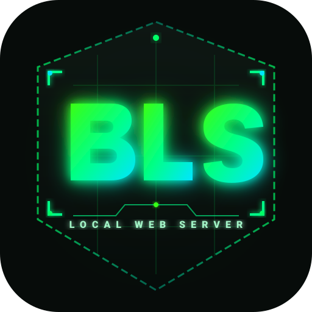

# ⚡ BLS — Lightweight Local Web Server

<p align="center">
  
  <br>
  <strong>A modern, simple, dark + green hacker-style local web server desktop application.</strong>
</p>

---

## 📦 Standalone Executables Ready to Use

Both **Linux AppImage** and **Windows .exe** binaries are compiled in the [`dist/`](dist/) folder:

| Platform | Executable File | Description |
| :--- | :--- | :--- |
| 🐧 **Linux** | [`dist/BLS-1.0.0.AppImage`](dist/BLS-1.0.0.AppImage) | Standalone 1-click Linux executable. No install required. |
| 🪟 **Windows** | [`dist/win-unpacked/BLS.exe`](dist/win-unpacked/BLS.exe) | Standalone Windows `.exe` application. |
| 🪟 **Windows (ZIP)** | [`dist/BLS-1.0.0-Windows-x64.zip`](dist/BLS-1.0.0-Windows-x64.zip) | Portable Windows ZIP archive containing `BLS.exe`. |

### Running on Linux:
```bash
# Make executable and launch:
chmod +x dist/BLS-1.0.0.AppImage
./dist/BLS-1.0.0.AppImage
```

### Running on Windows:
- Simply extract `BLS-1.0.0-Windows-x64.zip` and double-click `BLS.exe`.

---

## 🚀 Running from Source

```bash
# 1. Install dependencies
npm install

# 2. Launch application
npm start
# or
./run.sh
```

---

## ✨ Features

- 📂 **Intuitive Folder Selection**:
  - Drag and drop any folder directly onto the app window.
  - Native OS directory picker dialog.
  - Quick recent projects bar for 1-click switching.
  - "Open in File Manager" button.
  - Built-in demo sample project (`test-sample/`).

- ⚡ **Instant Start & Stop Controls**:
  - High-visibility glowing power switch.
  - Live animated radar pulse indicator when online.
  - Active URL bar with 1-click **Open in Browser** and **Copy URL** buttons.
  - Global hotkeys: `Space` or `Ctrl+Enter` to start/stop.

- ⚙️ **Configurable Settings (Stored automatically)**:
  - **Port**: Custom port input with quick preset chips (`8080`, `3000`, `5000`, `8000`).
  - 🔒 **HTTPS (SSL)**: On-the-fly self-signed certificate generation.
  - 🏠 **Localhost Only**: Restrict to `127.0.0.1` or open to `0.0.0.0` for local LAN access (shows LAN IPs to test on phones & other devices).
  - 📂 **Directory Listings**: Custom stylish hacker-themed directory browser with file search, sizes, and timestamps when `index.html` is absent.
  - 🌐 **CORS Headers**: Enable `Access-Control-Allow-Origin: *` for cross-origin API testing, WebGL, fonts, and assets.
  - 🔄 **SPA Mode**: Single Page Application fallback routing for React, Vue, Svelte, and Angular projects.
  - 🚫 **Disable Cache**: Automatic `Cache-Control: no-cache` headers for live development refreshing.

- 📟 **Live Hacker Terminal Request Stream**:
  - Real-time HTTP/HTTPS traffic console with color-coded status codes (`200 OK`, `304 Not Modified`, `404 Not Found`, `500 Error`).
  - Response latency timing in milliseconds, bytes transferred, and client IP.
  - Search / Filter requests in real time.
  - Auto-scroll lock toggle and log clearing.

---

## 📁 Project Structure

```
BLS/
├── package.json
├── run.sh
├── bls.desktop
├── dist/
│   ├── BLS-1.0.0.AppImage            # Standalone Linux executable
│   ├── BLS-1.0.0-Windows-x64.zip     # Portable Windows ZIP package
│   └── win-unpacked/
│       └── BLS.exe                   # Windows executable
├── src/
│   ├── main/
│   │   ├── main.js                   # Electron main process & IPC handlers
│   │   ├── server.js                 # Express & HTTPS server manager & directory viewer
│   │   └── preload.js                # Secure contextBridge API
│   └── renderer/
│       ├── index.html                # Dark hacker UI interface
│       ├── css/
│       │   └── styles.css            # Hacker green styling & glow effects
│       ├── js/
│       │   ├── app.js                # UI state controller & event bindings
│       │   └── ui.js                 # Toast, status, log & uptime managers
│       └── assets/
│           ├── logo.svg              # Modern vector BLS logo
│           ├── icon.svg              # Vector app icon
│           ├── icon.ico              # Windows multi-size ICO icon
│           └── icon.png              # Rasterized app icon
└── test-sample/                      # Ready-to-serve interactive demo web page
    ├── index.html
    ├── style.css
    ├── app.js
    └── assets/
        └── data.json
```
